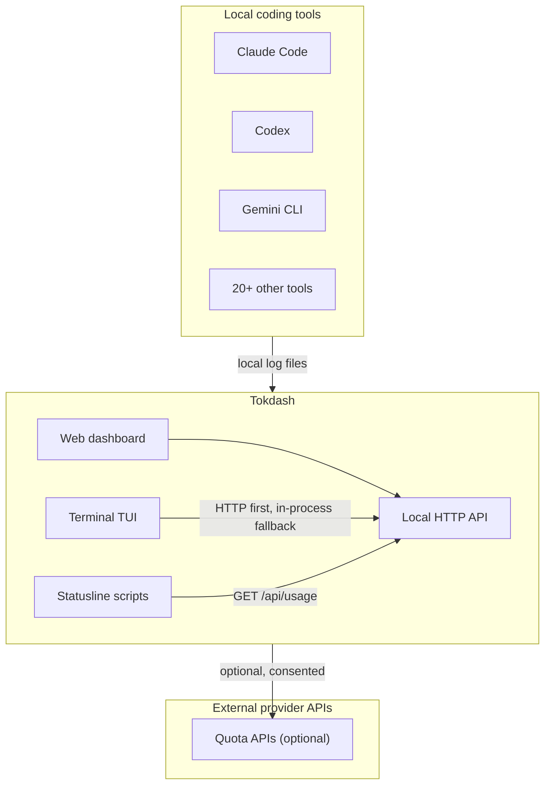
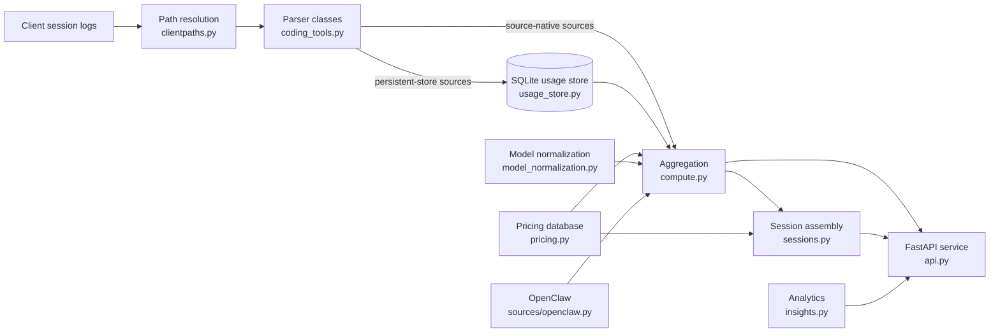
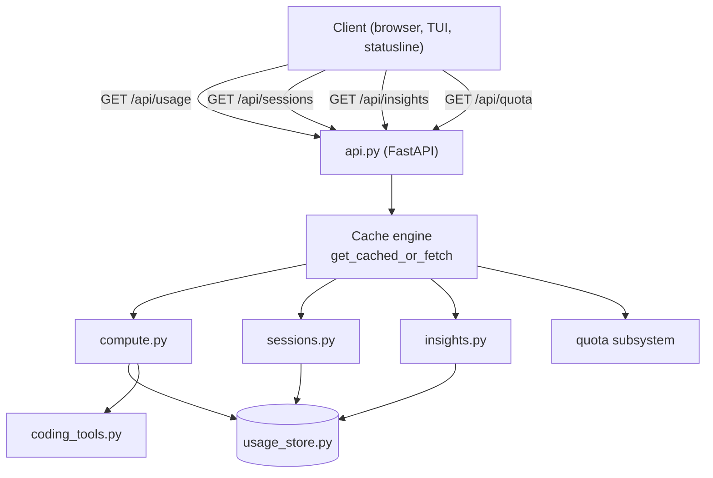
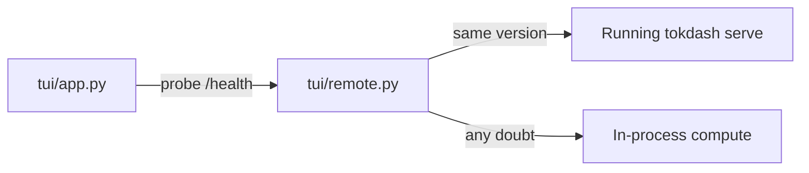

# Architecture

Tokdash is a local token and cost dashboard for AI coding tools. It reads local coding-tool activity, stores normalized usage for efficient queries, and presents it through web and terminal interfaces.

This document is the entrypoint. It provides the system context, the core data flow, the request/serving model, and the architectural invariants. Focused documents cover each subsystem in detail.

## System context

## Core usage data flow

**Not all sources follow the same path.** The diagram above shows the primary path. See [Data Flow](technical-notes/DATA_FLOW.md) for the full picture including source-native paths, OpenClaw, and live-parser fallback.

## Request and serving flow

### TUI serving model

The TUI uses an **HTTP-first, in-process-fallback** model:

The TUI probes for a live `tokdash serve` of the same version. If found, it delegates via read-only HTTP. Any doubt (version skew, connection failure, kill switch) falls back to the identical in-process compute path with byte-identical cache keys. See [Request Flow](technical-notes/DATA_FLOW.md#request-flow) for details.

### Statusline serving model

Statusline scripts call `GET /api/usage` directly. They do not import compute. They fail silently if Tokdash is not running.

## Architectural invariants

### Local-only by default

Tokdash binds to `127.0.0.1` by default. All API endpoints are loopback-only unless explicitly configured otherwise. See [Security](../../SECURITY.md) for the full security model.

### Persistent usage store is a cache, not the source of truth

Source logs remain the source of truth. The SQLite store is a local performance index. When the store is disabled or unavailable, Tokdash falls back to live parsers. See [Usage Accounting](technical-notes/USAGE_ACCOUNTING.md) for details.

### Three-identity separation

Each usage entry carries three independent identities:

- **Source identity** — file paths, mtimes, sizes (what was parsed)
- **Parse identity** — `persistent_parser_version` (how it was parsed)
- **Pricing identity** — content hash of the pricing database (what rates were used)

Pricing is NOT part of the parse signature. Rate edits reprice without reparsing. See [Usage Accounting](technical-notes/USAGE_ACCOUNTING.md) for details.

### Billing provenance is immutable

Each usage entry carries a billing record (`_billing`) that distinguishes:

- **`fixed`** — client-reported cost, preserved as authoritative, never repriced
- **`pricing`** — Tokdash-calculated cost, recomputed from stored token inputs on read

This separation means a pricing database edit reprices instantly without reparsing gigabytes of logs. See [Usage Accounting](technical-notes/USAGE_ACCOUNTING.md) for details.

### Transient failures are never cached

File locks and partial results bypass the LRU cache. Only genuine parse results are memoized. This prevents a transient file lock from poisoning the cache.

### Quota master switch gates everything

The quota master switch (`quota.enabled` or `TOKDASH_QUOTA_POLL=0`) gates all quota work: session scanning, network polling, and snapshot writes. When off, the poller idles completely. See [Quota Architecture](technical-notes/QUOTA_ARCHITECTURE.md) for details.

### Credential discovery is separate from network requests

`credential_sources.py` discovers and validates credentials from local files. It makes NO network calls. Provider collectors make the actual HTTP requests. These are gated by separate consent keys. See [Quota Architecture](technical-notes/QUOTA_ARCHITECTURE.md) for details.

## Failure and fallback behavior

| Failure | Behavior |
|---|---|
| SQLite unavailable | Fall back to live parsers; log warning once per process |
| Usage DB disabled | Live parsers only; no persistent cache |
| Parser fails | Source error collected; partial data still returned |
| Source log disappears | Durable mode keeps rows (marked missing); strict mode drops them |
| Source file changes | Signature mismatch triggers reparse |
| Pricing unavailable | Model costs $0.00; tokens still counted |
| Model unknown | Normalized to best effort; priced at $0.00 if no match |
| TUI cannot reach server | Falls back to in-process compute |
| Provider quota request fails | Status snapshot with error; other providers unaffected |
| Credentials unavailable | Provider shows "unavailable" status |
| Consent disabled | Provider skipped; local detection still works |

## Security and trust boundaries

Tokdash handles local coding-tool logs, credentials, and optional provider API requests. See [Security](../../SECURITY.md) for the full security policy.

Key boundaries:

- **Local log data** — read-only, never uploaded
- **Local SQLite data** — WAL mode, process-locked
- **Local credentials** — read-only, allowlisted hosts only
- **Provider APIs** — optional, consented, per-provider
- **Localhost HTTP server** — loopback-only by default, write-gated
- **Remote access** — opt-in, authenticated, Tailscale/proxy

## Documentation index

### Architecture

- [Data Flow](technical-notes/DATA_FLOW.md) — core usage data flow, source-native paths, OpenClaw, live-parser fallback
- [Usage Accounting](technical-notes/USAGE_ACCOUNTING.md) — cost provenance, pricing model, billing provenance
- [Quota Architecture](technical-notes/QUOTA_ARCHITECTURE.md) — quota subsystem, scheduler, consent gates, provider collectors
- [Session Architecture](technical-notes/SESSION_ARCHITECTURE.md) — session assembly, deduplication, active-time
- [Onboarding Architecture](technical-notes/ONBOARDING_ARCHITECTURE.md) — service lifecycle, updates, manifest
- [Source Parser Matrix](technical-notes/SOURCE_PARSER_MATRIX.md) — source/parser reference

### Reference

- [API reference](../../reference/API.md) — the local HTTP API
- [Configuration](../../reference/CONFIG.md) — environment variables and DB semantics
- [Quota tracking internals](../../reference/QUOTA.md) — consent commands and per-provider notes
- [Supported clients](../../reference/SUPPORTED_CLIENTS.md) — which tools Tokdash reads

### Guides

- [Onboarding](../../guides/ONBOARDING.md) — setup, doctor, update, uninstall
- [Remote access](../../guides/REMOTE_ACCESS.md) — reaching a Tokdash instance from another machine
- [Statusline templates](../../guides/statusline/README.md) — ready-made statusline scripts

## Maintenance

This documentation reflects the current implementation. Major architectural changes should update the relevant diagram or document. Diagrams are not a substitute for source code — the source code remains authoritative.
