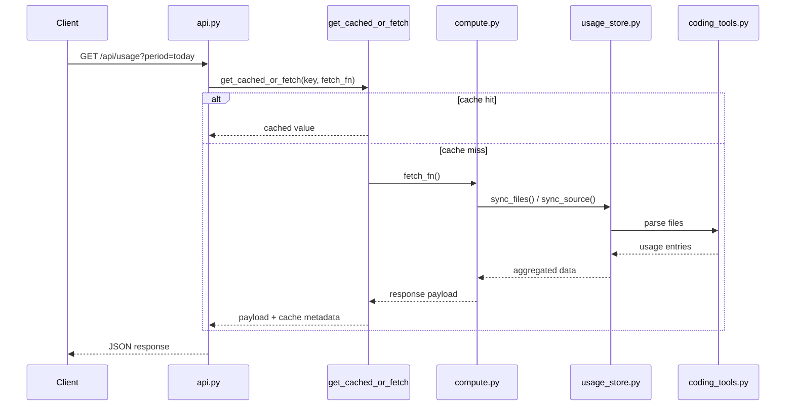
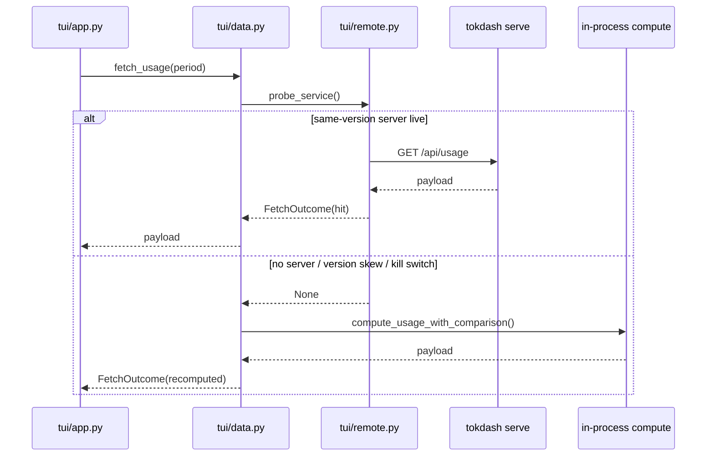

# Data Flow

This document describes how data moves through Tokdash: from source logs to persistent store to compute to presentation.

## Source data

Tokdash reads usage from 28 parsers across 20+ coding tools. All sources are local-only — no network-backed usage sources.

### Sync modes

Each parser declares a sync capability that determines how it interacts with the persistent store:

- **`file_replace`** — Unchanged files stay indexed; changed files reparsed. Stored in `usage_entries` table. 17 parsers use this mode.
- **`source_replace`** — Source-wide replacement required for correctness. Stored in `usage_entries` table. 5 parsers use this mode.
- **`source_native_db`** — Queried live from source DB; never copied into `usage_entries`. 6 parsers use this mode (OpenCode, Kilo, Mimo, ZCode, QoderIde, Devin).

### Session-capable sources

4 sources are session-capable (`session_store=True`):

- **Codex** — JSONL rollout files
- **Claude Code** — JSONL streaming snapshots
- **DeepSeek Harness** — JSONL (zstd-compressed)
- **Reasonix** — JSONL (daily stats)

These sources populate the `session_records` table and appear in the Sessions tab.

### Self-reporting costs

4 sources report their own costs (PiAgent via `use_recorded_cost=True` class attribute; Hermes, Mimo, and Qoder CLI implement self-reporting directly in their parse logic):

- **Pi Agent** — `usage.cost.total` when positive
- **Hermes** — `actual_cost_usd`, then `estimated_cost_usd`
- **Mimocode** — `data.cost` field
- **Qoder CLI** — credit-based, converted to USD

These costs are preserved as authoritative when present. See [Usage Accounting](USAGE_ACCOUNTING.md) for the full cost provenance model.

## Ingestion and parsing

### Discovery

`clientpaths.py` resolves paths for 30+ coding tools. It is a pure function module with no state. Key properties:

- Env-var overrides honored per-tool
- OS-aware (Windows/macOS/Linux/WSL) for Zed, Qoder, Devin, Hermes
- Union semantics for multi-root tools (Antigravity, Qoder CLI, Devin, WorkBuddy)
- Precedence semantics for single-winner tools (Qoder IDE, Kilo, Devin)

### Parser selection

`coding_tools.py` contains `BaseParser` (ABC) + 27 concrete parser classes + `CodingToolsUsageTracker` registry. Each parser implements:

- `_file_signatures()` — returns `(path, mtime_ns, size)` tuples for change detection
- `_parse_all()` — returns list of normalized usage entries
- `collect(since, until)` — date-filtered entries (cached by signature + pricing signature)

### Signature and cache behavior

Each parser declares a `persistent_parser_version` (int or `None` for live-query sources). The source signature combines:

- File paths, mtimes, sizes
- Parser version
- Extra context (e.g., fork ancestry for Pi)

When the signature changes, the file is reparsed. When it doesn't, the stored rows are reused.

### Incremental synchronization

For `file_replace` sources, the store tracks a `safe_offset` per file. On resync:

- Unchanged files: 0 bytes read
- Grown files: seek to stored offset, parse only the new segment
- Shrunken files: re-read whole file

For `source_replace` sources, the entire source is reparsed and replaced.

### Source-native paths

6 sources are queried live from their own databases, never copied into `usage_entries`:

- **OpenCode** — SQLite DB, per-query cache (32 entries)
- **Kilo Code** — SQLite DB, subclass of OpenCodeParser
- **Mimocode** — SQLite DB, per-query cache
- **ZCode** — SQLite DB, WAL mode, temp-dir snapshot
- **Qoder IDE** — SQLite DB, temp-dir snapshot
- **Devin** — SQLite DB, WAL snapshot for drvfs/UNC

These sources are always fresh but slower per-query. They appear in the combined view through `compute.py`'s merge logic.

### Malformed/unavailable source behavior

- **File vanished** — `UsageFileVanished` raised; durable mode keeps rows (marked missing), strict mode drops them
- **File unreadable** — `UsageFileUnreadable` raised; same durable/strict behavior
- **Corrupt SQLite DB** — per-DB skip; remaining DBs still serve
- **Malformed JSONL** — line skipped; parse continues

## Persistence

### SQLite usage store

`usage_store.py` maintains the local SQLite database at `~/.tokdash/usage.sqlite3` (WAL mode, synchronous=NORMAL).

**Tables:**

| Table | Purpose |
|---|---|
| `meta` | Key-value: schema version, pricing identity, repair watermarks |
| `source_state` | Per-source: signature, updated_at, entry_count |
| `file_state` | Per-file: mtime, size, safe_offset, missing, signature |
| `usage_entries` | Main table: id, source, model, tokens, cost, billing_json |
| `session_records` | Session metadata: tool, session_id, file_path, timestamps |
| `quota_snapshots` | Quota observations: provider, bucket, used_percent, resets_at |
| `quota_file_state` | Quota file watermarks |

**Key patterns:**

- **WAL mode** — readers don't block writers
- **Billing provenance separation** — `raw_json` (public) vs `billing_json` (private) enables repricing without reparsing
- **Entry key dedup** — unique partial index on `(source, entry_key)` prevents duplicates
- **Durable missing** — `missing=1` flag preserves rows for disappeared files
- **Safe offset** — tracks parse position for tail-append optimization
- **Cost authoritative** — distinguishes provider-reported costs from computed costs

### What is durable vs recomputed

- **Durable:** token counts, model IDs, billing inputs (token breakdown), source identity
- **Recomputed:** cost (from billing inputs + pricing DB), aggregated totals, session summaries, insights

### Locking and concurrency

- **Process lock** — `filelock.py` provides cross-platform advisory locking (POSIX `fcntl.flock`, Windows `msvcrt.locking`)
- **Single-flight sync** — concurrent syncs for same source deduplicated; waiter skips if holder completed
- **WAL deferred transaction** — reads use snapshot isolation; retries up to 3 times under racing writes

### Retention behavior

- **Usage entries** — kept indefinitely by default; `TOKDASH_USAGE_DB_DURABLE=0` for strict source replacement
- **Quota snapshots** — kept indefinitely by default; `TOKDASH_QUOTA_RETENTION_DAYS` to prune
- **Session records** — kept indefinitely; no retention mechanism

## Computation

### Aggregation

`compute.py` owns aggregation and coordinates parser synchronization. Key functions:

- `compute_usage(period, date_from, date_to)` — merges OpenClaw + coding tools into one response
- `compute_stats(year)` — contribution graph + streaks + model rankings
- `get_tools_data(period)` — coding-tool usage
- `get_session_data(period)` — OpenClaw session usage

The sync pipeline (`_sync_usage_store`):

1. Apply pricing first (catch inter-process races)
2. Iterate selected parsers, calling `store.sync_files()` or `store.sync_source()`
3. Re-apply pricing after sync (catch races)

### Date ranges

All date arithmetic is DST-safe. Window boundaries are built from dates, never by adding timedeltas to aware instants. `dateutil.py` provides `local_midnight()` and `parse_date_range()`.

### Cost calculation

Cost is computed from billing inputs + pricing DB. The pricing DB is NOT the universal source of truth — some sources preserve authoritative client-reported costs. See [Usage Accounting](USAGE_ACCOUNTING.md) for the full model.

### Model normalization

`model_normalization.py` canonicalizes model names for cross-source aggregation. The pipeline:

1. Strip leading `models?[:/]` prefix
2. Drop provider/app prefix chain (last `/`-delimited segment)
3. Strip known vendor prefixes
4. Replace whitespace/underscores with hyphens
5. Strip trailing release noise (`-latest`, `-stable`, `-preview`, dates)
6. Strip `-thinking` suffix
7. Apply explicit alias map
8. Convert hyphenated version numbers (`4-5` → `4.5`)
9. Normalize Anthropic opus/sonnet names
10. Collapse Kimi K2 point-release variants

### Sessions

`sessions.py` (300KB, the largest module) handles session assembly, deduplication, and caching. See [Session Architecture](SESSION_ARCHITECTURE.md) for details.

### Insights

`insights.py` provides fine-grained analytics (hourly, weekday, heatmap, models, tools, streaks) through a single composite scan. Unknown facets raise `UnknownFacetError` — they are refused, not silently dropped.

## Presentation

### FastAPI/WebUI

`api.py` is the FastAPI application. It exposes REST endpoints for usage, sessions, insights, quota, and pricing data. All heavy computes go through `get_cached_or_fetch` which enforces the compute semaphore.

Key routes:

- `GET /api/usage` — aggregated token usage + cost
- `GET /api/sessions` — list sessions for a tool
- `GET /api/insights` — facet-selected analytics
- `GET /api/quota` — quota state
- `GET /api/stats` — annual stats

### TUI

The TUI uses HTTP-first with in-process fallback. See [Request Flow](#request-flow) below.

### Statusline

Statusline scripts call `GET /api/usage` directly. They do not import compute.

## Request flow

### API request path

### TUI request path

The TUI's `data.py` uses the same cache key helpers as `api.py` routes, so a warmed key from the server is a hit in the TUI and vice versa.

### Quota request path

Quota is NEVER delegated to the remote server. It is always in-process:

- `fetch_quota_state()` — always in-process `quota_state()`
- `fetch_quota_history()` — always in-process `UsageEntryStore().quota_history()`

The TUI's `u` key triggers a one-shot quota poll via `_poll_quota()`.

## OpenClaw path

OpenClaw is a standalone parser (not a `BaseParser` subclass). It has its own corpus cache and store sync:

- `collect_session_corpus()` — collects session files into a `SessionCorpus`
- `corpus_for_signature()` — cached corpus lookup (max 8)
- `get_usage_for_days/month/range/year()` — usage aggregation

OpenClaw data flows through `compute.py` directly, not through the persistent store. It is session-capable and self-reporting (pricing DB wins, OpenClaw's recorded cost is fallback).

## Live-parser fallback

When the persistent store is disabled or unavailable:

1. `persistent_usage_db_enabled()` returns False
2. `compute.py` skips store sync
3. All sources are queried live
4. Results are returned without caching

This is slower but always correct. The store is a cache, not the source of truth.
