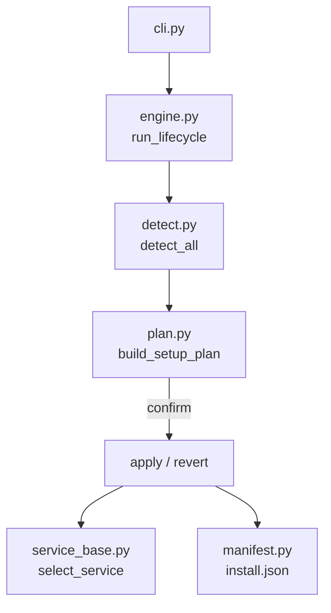
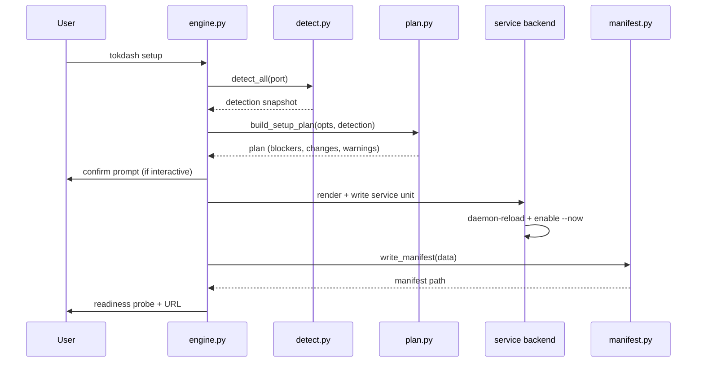
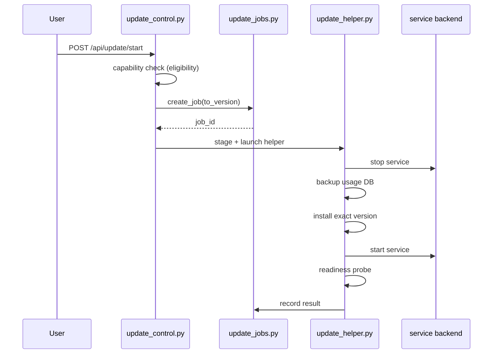
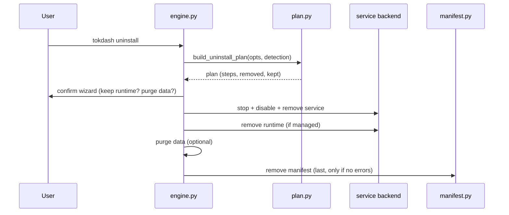

# Onboarding Architecture

This document describes the Tokdash service lifecycle: setup, doctor, update, uninstall, and the manifest that makes it all reversible.

## Overview

The `onboard/` package implements a **detect → plan → (confirm) → apply/revert → record/report** pipeline. Every lifecycle route runs through the same engine (`engine.py`); only input-gathering differs.

## Lifecycle routes

All routes are dispatched from `cli.py` to `engine.run_lifecycle(args)`:

- `tokdash setup` — detect, plan, apply, record
- `tokdash doctor` — read manifest, probe, report
- `tokdash update` — read manifest, validate, install, restart
- `tokdash update-enroll` — mint pairing code for remote update
- `tokdash uninstall` — plan, confirm, revert, remove manifest

## Setup flow

### Non-interactive guard

Mutation requires an explicit non-interactive signal (`--auto`/`--yes` or a TTY + confirm). Without it, the engine prints the plan and exits 2.

### Readiness probe

After setup, the engine probes:

- `/health` fingerprint match
- Service liveness (systemd/launchd/winsched)
- Port holder check

## Service backends

`service_base.py` provides a `Protocol` for service backends and a registry. The selection is OS-specific:

| OS | Backend | Unit file | Start command |
|---|---|---|---|
| Linux/WSL | `systemd.py` | `~/.config/systemd/user/tokdash.service` | `systemctl --user enable --now` |
| macOS | `launchd.py` | `~/Library/LaunchAgents/com.tokdash.tokdash.plist` | `launchctl bootstrap gui/<uid>` |
| Windows | `winsched.py` | `%LOCALAPPDATA%/Tokdash/Tokdash.xml` | `schtasks /Create /XML` + `/Run` |

### Ownership markers

Every service unit carries an ownership marker so uninstall only removes provably setup-owned items:

- **systemd** — `# X-Tokdash-Managed id=<hex>` comment in unit
- **launchd** — `<!-- X-Tokdash-Managed id=<hex> -->` comment in plist
- **winsched** — `Managed-by: tokdash-setup` + marker in XML Description

## Manifest

`manifest.py` manages `install.json` — the single record of what setup created. It is:

- **Written last** during setup (only if no errors)
- **Read** by doctor, update, uninstall
- **Removed last** during uninstall (only if no errors)
- **Atomic** — writes via tmp + replace
- **Never raises** on read (returns None on missing/corrupt)

The manifest contains: schema, install method, runtime kind/command, python path/version, service block, tailscale serve config, data dir, bind, port, created at.

## Update flow

### Update eligibility

`update_eligibility.py` is stricter than terminal `update`. It proves — not infers — that the running installation is one setup fully manages:

- Manifest exists
- Install method is pipx or managed-venv
- Data dir matches
- Interpreter exists
- Marker present
- Service type is supported (only systemd-user)
- Loaded unit matches marker + runtime
- Cgroup identity proof

### Update authorization

`update_auth.py` provides two-plane authorization:

- **Localhost** — existing write gate (loopback + Host/Origin + CSRF)
- **Remote** — exact HTTPS origin + enrolled operator session + CSRF

Pairing codes are 8-char, 5-min TTL, single-use, 12-attempt rate limit. Sessions are 30-day TTL, max 20 stored.

### Update job journal

`update_jobs.py` provides a durable journal (`update_jobs.json`) shared by dashboard updater and CLI:

- **Attach, don't double-apply** — shared lock + live job detection
- **Result survives outage** — journal is durable
- **No endless updating** — stale jobs reconciled to `failed/interrupted`
- **Bounded** — max 20 jobs, atomic writes

## Uninstall flow

Uninstall is **partial-safe**: errors are collected, manifest is preserved for retry.

## Doctor flow

`tokdash doctor` reads the manifest and probes:

- Port status
- Python fitness
- Service status
- Usage DB schema
- Update check
- Quota state

It reports an issues list and exits 0 if no issues, 1 otherwise.

## Failure behavior

| Failure | Behavior |
|---|---|
| Non-interactive without `--auto` | Prints plan, exits 2 |
| Blocker in plan | Prints plan + errors, exits 1 |
| Service fails to start | Reports error, exits 1 |
| Update install fails | Service recovery + `failed/install` phase |
| Update start fails | `failed/starting` phase with backup preserved |
| Uninstall partial failure | Errors collected, manifest preserved for retry |
| Manifest missing | Doctor reports "not installed" |
| Manifest corrupt | Doctor reports "not installed" |

## Key design principles

- **Mutation requires explicit non-interactive signal** — no TTY + no `--auto`/`--yes` → plan only
- **Ownership markers everywhere** — uninstall only removes provably setup-owned items
- **Manifest is the revert contract** — written last, removed last
- **Fail-closed on uncertainty** — strict probes for uninstall teardown
- **Partial-safe uninstall** — errors collected, manifest preserved
- **Attach, don't double-apply** — shared update lock + live job detection
- **No shell injection** — all argv exec'd, never interpolated
