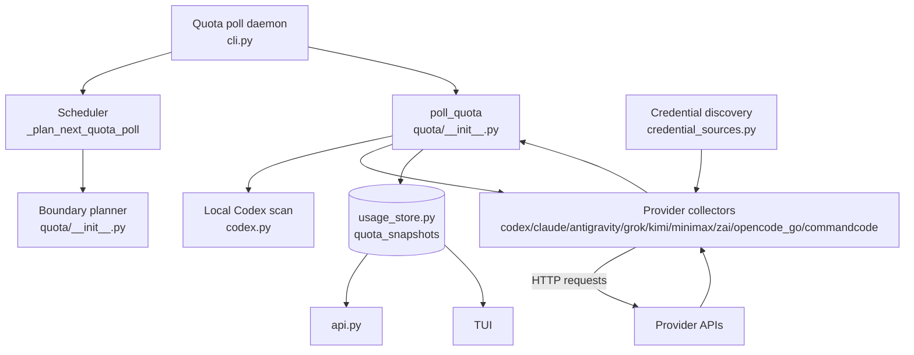
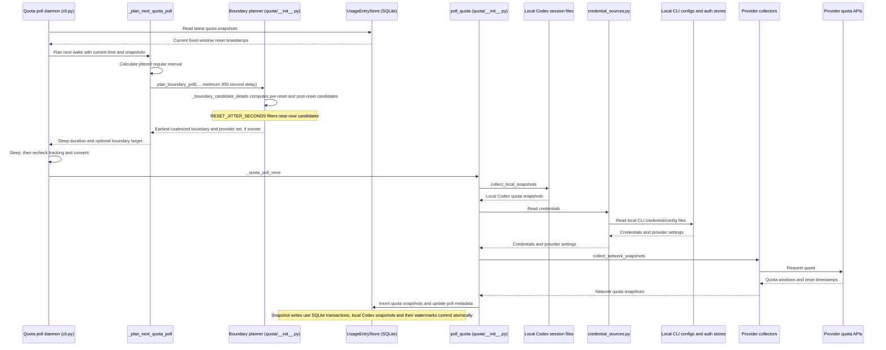
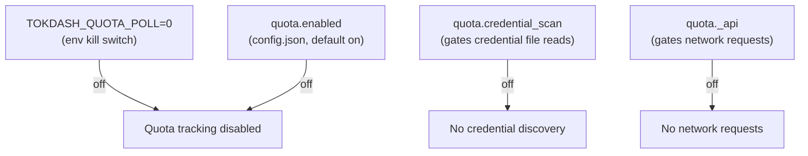

# Quota Architecture

This document describes the quota subsystem: the scheduler, polling logic, consent gates, and provider collectors.

## Overview

Quota tracking is a distinct subsystem that runs alongside usage aggregation. It collects quota snapshots from local Codex session files and remote provider APIs, stores them in the same SQLite usage database, and presents them through the API and TUI.

## Scheduler

The daemon in `cli.py` schedules regular polls and consults the quota boundary planner for earlier provider-scoped samples.

### Regular polling

- Default interval: 30 minutes (1800 seconds)
- Configurable: 15/30/60/120 minutes via `tokdash quota consent --poll-interval N`
- Env override: `TOKDASH_QUOTA_POLL_INTERVAL` (seconds, floor 300)
- Saved as `quota.poll_interval_minutes` in `config.json`
- Interval changes apply on the next poll cycle without restarting

### Reset-boundary sampling

For fixed-reset quota windows, the poller also samples near the reset boundary:

- **Pre-reset sample** — fires `TOKDASH_QUOTA_BOUNDARY_PRE_SECONDS` (default 120s) before the reset
- **Post-reset sample** — fires `TOKDASH_QUOTA_BOUNDARY_POST_SECONDS` (default 120s) after the reset
- Coalesces nearby provider boundaries into a single poll
- Keeps at least 300 seconds between daemon poll cycles

### Jitter

The scheduler adds jitter to the regular interval to avoid thundering herd. `RESET_JITTER_SECONDS` filters near-now candidates — candidates within the jitter window of `now` are dropped, not just those at or before it. This prevents duplicate fires from poll-to-poll jitter.

### Near-now filtering

Candidates within `RESET_JITTER_SECONDS` of `now` are dropped. This is because `resets_at` jitters +/-1s poll-to-poll (providers round the wall clock differently each poll), so a bare `> now` guard re-arms the boundary we just fired.

## Poll flow

## Master switch and consent gates

The quota subsystem has a hierarchical consent model:

### Master switch hierarchy

1. `TOKDASH_QUOTA_POLL=0/false/no/off` env → hard kill (always wins)
2. `quota.enabled` in config.json → persisted user preference (default True)
3. `quota.credential_scan` → gates all credential file reads
4. Per-provider `quota.<provider>_api` → gates network requests

### Legacy grandfather

On upgrade, if `credential_scan` was never stored, it is derived from legacy provider keys (`codex_api`, `claude_api`, `antigravity_api`). If any of those was True, `credential_scan` is implicitly True until the user makes an explicit choice.

## Credential discovery vs network requests

**Credential discovery** (`credential_sources.py`) and **network requests** (per-provider collectors) are separate:

| Aspect | Credential Discovery | Network Requests |
|---|---|---|
| **Consent gate** | `credential_scan_enabled()` | `network_enabled(key)` |
| **What it reads** | Local files: auth.json, .credentials.json, config.toml, CC-Switch SQLite, macOS Keychain, env vars | Remote APIs: chatgpt.com, api.anthropic.com, etc. |
| **Allowlist** | `endpoint_host_allowed()` — HTTPS + exact host match | Each provider has its own `_ALLOWED_HOSTS` frozenset |
| **Failure mode** | Returns `[]` or `None` — never raises | Returns `QuotaSnapshot` with `status="unavailable"` or `"fetch_error"` |
| **Module** | `credential_sources.py` + per-provider `_credentials()` functions | Per-provider `collect_*_api_snapshots()` functions |

Only `kimi.py`, `minimax.py`, and `zai.py` import `credential_sources.py` directly. The others receive credentials through `quota/__init__.py`.

## Provider collectors

Each provider has its own collector module in `sources/quota/`:

| Collector | Provider | API endpoint | Auth method |
|---|---|---|---|
| `codex.py` | Codex | `chatgpt.com/backend-api/wham/usage` | Bearer token from auth.json |
| `claude.py` | Claude Code | `api.anthropic.com/api/oauth/usage` | OAuth token from .credentials.json |
| `antigravity.py` | Antigravity | `daily-cloudcode-pa.googleapis.com/v1/internal` | Token from file or Keychain |
| `grok.py` | Grok Build | `cli-chat-proxy.grok.com/v1/billing` | OIDC token from auth.json |
| `kimi.py` | Kimi Code | `api.kimi.com/coding/v1/usages` | API key or OAuth |
| `minimax.py` | MiniMax | `api.minimax.io/v1/token_plan/remains` | Token Plan key or API key |
| `zai.py` | Z.ai | `api.z.ai/api/monitor/usage/quota/limit` | Raw token (not Bearer) |
| `opencode_go.py` | OpenCode Go | `opencode.ai/zen/go/v1/usage` | API key from auth.json |
| `commandcode.py` | Command Code | `api.commandcode.ai/alpha/billing` | API key from env or auth.json |

### Local Codex snapshot collection

Codex is the only provider with a local snapshot path. `collect_local_snapshots()` reads Codex session files and extracts quota data without any network calls. This runs on every poll cycle and is gated only by the master switch, not by credential scan or network consent.

The local Codex scan is incremental — after a one-time backfill, each cycle only tail-reads session files that grew.

## Snapshot storage

Quota snapshots are stored in the `quota_snapshots` table in the same SQLite usage database. Each snapshot has:

- `provider` — provider name
- `account` — account identifier
- `bucket` — quota bucket (5h, 7d, monthly, etc.)
- `bucket_label` — display label
- `used_percent` — percentage used
- `resets_at` — reset timestamp
- `plan` — plan name
- `captured_at` — capture timestamp
- `source` — `codex_session` or provider API name
- `status` — `ok`, `unavailable`, `stale_token`, `fetch_error`
- `raw_json` — raw response data

Snapshots are upserted on `(provider, account, bucket, source, captured_at)`. The latest write wins.

## Manual refresh

The WebUI and TUI can trigger manual refreshes:

- **WebUI** — `GET /api/quota/refresh` (read-only, no write gate)
- **TUI** — `u` key triggers `_poll_quota()`

Manual refresh runs `poll_quota()` immediately, bypassing the scheduler. It respects all consent gates.

## Failure behavior

| Failure | Behavior |
|---|---|
| Master switch off | Poller idles; `quota_state()` returns minimal state |
| Credential unavailable | Provider shows "unavailable" status |
| Network request fails | Provider shows "fetch_error" status; other providers unaffected |
| Token expired | Provider shows "stale_token" status |
| Store unavailable | Falls back to in-memory snapshots |
| Consent disabled | Provider skipped; local detection still works |

## Retention

Quota snapshots are kept indefinitely by default. `TOKDASH_QUOTA_RETENTION_DAYS` can be set to a positive number of days to prune older snapshots on every insert.
