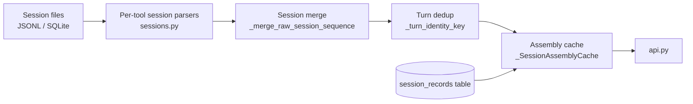

# Session Architecture

This document describes how Tokdash assembles, deduplicates, and presents session-level data.

## Overview

`sessions.py` (300KB, the largest module in Tokdash) handles session assembly, deduplication, and caching. It serves the Sessions tab, Session Explorer, and Active Time features.

## Session-capable sources

4 sources are session-capable (`session_store=True`):

- **Codex** — JSONL rollout files
- **Claude Code** — JSONL streaming snapshots
- **DeepSeek Harness** — JSONL (zstd-compressed)
- **Reasonix** — JSONL (daily stats)

These sources populate the `session_records` table and appear in the Sessions tab. In addition, `sessions.py` handles 5 stored session tools: Codex, Claude, Kimi, DSH, and Reasonix.

## Session assembly pipeline

### Per-tool session parsers

Each session-capable source has its own parser in `sessions.py`:

- `_parse_codex_session_file` — Codex JSONL rollout parser (v2). Handles thread_spawn ancestry, fork replay dedup, guardian/review sessions, model placeholder backfill.
- `_parse_claude_session_file` — Claude JSONL parser (v3). Streaming snapshot collapse via `claude_usage_supersedes`, subagent stream separation.
- `_parse_dsh_session_file` — DeepSeek Harness decoder (v1). Uses shared `dsh_log.py` decoder.

### Session merge

Sessions from multiple files are merged using `_merge_raw_session_sequence()` — an O(K) left-fold that replaces O(K²) pairwise merge. The merge:

- Deduplicates turns by `_turn_identity_key` (event_key or field-tuple)
- Prefers explicit display names
- Preserves `_subagent_parent_id`
- Produces deterministic output (same input → same output)

### Turn deduplication

Turns are deduplicated by stable event keys (per-tool), not by timestamp. The key is either:

- An explicit `event_key` from the source
- A field-tuple fallback (e.g., `(turn, step, attempt)` for DSH)

### Cross-session deduplication

For Codex, `_drop_codex_subagent_replay_turns()` removes replayed parent-prefix turns from fork children. This is cross-session dedup by event key. It handles orphan siblings (earliest keeps prefix).

## Caching

### Three-layer caching

1. **Persistent SQLite store** — `session_records` table with billing inputs, priced on read
2. **In-memory assembly cache** — `_SessionAssemblyCache` keyed by `(tool, session_id)` with token-based invalidation
3. **Per-file parse cache** — `lru_cache` wrapper that does NOT cache transient failures

### Assembly cache

`_SessionAssemblyCache` is an LRU cache with a turn-count budget (`TOKDASH_SESSION_CACHE_TURNS`, default 500k). It is:

- Keyed by `(tool, session_id)`
- Invalidated by file signature changes (not by time)
- Reusable across all windows/periods
- Thread-safe

### Transient-failure isolation

File locks and partial results bypass the LRU cache:

- `_SessionFileUnavailable` — raised on file open failure, NOT cached
- `_PartialSessionView` — carries partial result, NOT cached

This prevents a transient file lock from poisoning the cache.

## Active time

Active time is estimated from session events. The algorithm:

1. Group events by `_stream_id` (concurrent streams kept separate)
2. For each stream, build working intervals:
   - If `_work_ms` is available (Reasonix/ZCode), use it directly
   - Otherwise, use capped-gap heuristic: count each gap between consecutive events up to an idle cap
3. Merge intervals across streams (union, counting overlap once)
4. Clip to the requested window

The idle cap is configurable via `TOKDASH_ACTIVE_GAP_CAP_SECONDS` (default 300s, clamped to 1s–6h).

### Active time metrics

- `active_ms` — clock time, with overlap counted once (wall-clock)
- `active_ms_sum` — agent time, with overlap summed up

Both appear per session and per tool in the summary.

## Stored-session path

When the persistent store is enabled, sessions are read from the `session_records` table:

1. Sync session files (signature-based, incremental)
2. Query records for the requested tool and date range
3. Merge via `_raw_sessions_from_records`
4. Apply Codex replay dedup + title map
5. Return assembled sessions

This is faster than live parsing but requires the store to be enabled and up-to-date.

## Pricing on read

Stored session rows carry billing inputs, not costs. Cost is computed on read from the current pricing database. This means:

- A pricing database edit reprices sessions instantly
- Rate edits don't trigger reparsing
- The `cost_authoritative` flag distinguishes fixed costs from computed costs

**Exception:** Codex rows carry provider-qualified model names and do NOT get free migration to priced-on-read (ambiguous provider resolution).

## Session detail

`get_session_detail(tool, session_id)` returns a single session with:

- Turn-by-turn breakdown
- Rich metadata (model, project, display name)
- Active time stats
- Activity insights (for Codex: reasoning effort, tool calls)

## Activity insights

`activity_insights.py` tracks reasoning effort levels and structured tool calls for Codex sessions:

- `record_reasoning_turn(record, turn_id, effort)` — records one reasoning turn's effort level
- `record_structured_tool_call(record, call_id, name, specificity)` — records one tool call
- `build_activity_insights(records)` — merges activity records across files/sessions

Activity records are built during session parsing and passed to `build_activity_insights()`. Only primary files (`is_primary: True`) contribute; subagent/guardian records are excluded.

## Failure behavior

| Failure | Behavior |
|---|---|
| Transient file lock | `_SessionFileUnavailable` raised, NOT cached; next request retries |
| Partial aggregate | `_PartialSessionView` returned, NOT cached; next request rebuilds |
| Persistent store failure | Fall back to live source files; log warning |
| Corrupt SQLite DB | Per-DB skip; remaining DBs still serve |
| Missing session file | `None` returned (cached — file is gone permanently) |
| Unsupported tool | `ValueError` raised |
| Active-time tool failure | Tool dropped from aggregate, named in `unavailable_tools` |
| Pricing signature drift | Singleton auto-reloads on next call |
