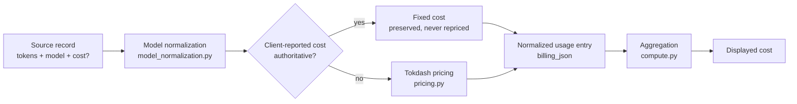

# Usage Accounting

This document describes how Tokdash calculates usage and cost, and how cost provenance is preserved.

## Cost provenance model

Tokdash does NOT use a single source of truth for costs. Each source record carries its own cost fields, and Tokdash decides whether to preserve the client-reported cost or calculate its own.



## Where token counts originate

Token counts come from the source log files. Each parser extracts:

- `input` — fresh input tokens
- `output` — output tokens
- `cache_read` — cache read tokens
- `cache_write` — cache write tokens
- `reasoning` — reasoning tokens (subset of output)

These are stored in the `usage_entries` table and in `raw_json` for repricing.

## Where model IDs originate

Model IDs come from the source log files. They are normalized by `model_normalization.py` before pricing lookup. The normalization pipeline handles provider prefixes, vendor prefixes, release suffixes, and alias maps.

## Where pricing happens

`pricing.py` and `PricingDatabase` resolve model IDs to per-token rates. The resolution order:

1. Exact keys
2. Alias map
3. Normalized key
4. Suffix-stripped key
5. Version-dot conversion (`4-5` → `4.5`)
6. Kimi aliases

The pricing database is a JSON file (`pricing_db.json`) shipped with the package, with user overrides under the data dir. The override is authoritative — full replacement, not merge.

## When Tokdash calculates cost

Tokdash calculates cost when:

- The source does not report a cost
- The source reports a cost of 0 or negative
- The source's cost is not authoritative (e.g., OpenClaw's recorded cost is fallback)

The calculation uses the stored token inputs and the current pricing database. This means a pricing database edit reprices instantly without reparsing.

## When Tokdash preserves client-reported cost

Tokdash preserves client-reported cost when:

- **Pi Agent** — `usage.cost.total` when positive
- **Hermes** — `actual_cost_usd`, then `estimated_cost_usd`
- **Mimicode** — `data.cost` field
- **Qoder CLI** — credit-based, converted to USD
- **OpenClaw** — recorded cost when model doesn't resolve (fallback)

These costs are marked as `fixed` in the billing record and are NEVER repriced.

## Which sources have authoritative recorded costs

| Source | Cost field | Authoritative | Notes |
|---|---|---|---|
| Pi Agent | `usage.cost.total` | Yes, when positive | Fallback to pricing DB |
| Hermes | `actual_cost_usd`, `estimated_cost_usd` | Yes, when positive | Fallback to pricing DB |
| Mimicode | `data.cost` | Yes, when positive | Fallback to pricing DB |
| Qoder CLI | credits | Yes, converted to USD | Fallback to pricing DB |
| OpenClaw | `usage.cost` / `usage.totalCost` | Fallback only | Pricing DB wins |
| All others | None | No | Priced by Tokdash |

## What happens when a model cannot be priced

When a model cannot be priced:

- The model is normalized to best effort
- If no pricing match is found, cost is $0.00
- Tokens are still counted in full
- The row is stored with `cost_authoritative = 0` (not authoritative)

## What happens when a source has both token data and recorded cost

When a source has both token data and recorded cost:

- If the recorded cost is authoritative (see table above), it is preserved as `fixed`
- The token data is still stored for aggregation and display
- The cost is NOT recomputed from tokens — the recorded cost wins
- If the recorded cost is not authoritative (e.g., OpenClaw), the pricing DB is used

## Whether cost is recomputed or preserved during synchronization

During synchronization:

- **Fixed costs** are preserved as-is. They are never repriced.
- **Pricing costs** are recomputed from stored token inputs and the current pricing database.
- The pricing database is applied BEFORE and AFTER sync to catch inter-process races.

This means:

- A pricing database edit reprices instantly without reparsing
- A source log change triggers reparse, which may change token counts but not fixed costs
- The `cost_authoritative` flag distinguishes the two cases

## How changes in pricing/model identity affect stored data

- **Pricing DB edit** — all `pricing`-type costs are recomputed on next read. No reparse needed.
- **Model normalization change** — affects new parses only. Stored rows keep their original model key.
- **Parser version change** — triggers reparse of affected files. New rows use the new parser.
- **Source file change** — triggers reparse of that file. Stored rows are replaced.

## Billing provenance in the store

Each usage entry carries a billing record (`_billing` in `billing_json`):

```json
{
  "mode": "fixed",
  "cost": 0.05,
  "cost_authoritative": 1
}
```

or:

```json
{
  "mode": "pricing",
  "rule": "fresh-input",
  "input": 1000,
  "output": 500,
  "cache_read": 0,
  "cache_write": 0,
  "reasoning": 0
}
```

The `fixed` mode preserves the client-reported cost. The `pricing` mode stores the token inputs and recomputes cost on read.

## Three-identity separation

Each usage entry carries three independent identities:

- **Source identity** — file paths, mtimes, sizes (what was parsed)
- **Parse identity** — `persistent_parser_version` (how it was parsed)
- **Pricing identity** — content hash of the pricing database (what rates were used)

Pricing is NOT part of the parse signature. Rate edits reprice without reparsing. This is the key architectural decision that makes the store a cache rather than a snapshot.

## Cache hit rate

The cache hit rate is calculated as:

```
cache_hit_rate = tokens_cache / (tokens_in + tokens_cache)
```

Where `tokens_in` is the fresh input tokens and `tokens_cache` is the cache read tokens. The denominator is prompt input only, never output or reasoning.

`cacheWrite` is billable input — it is folded into `tokens_in` for display but kept separate in billing records for repricing.
